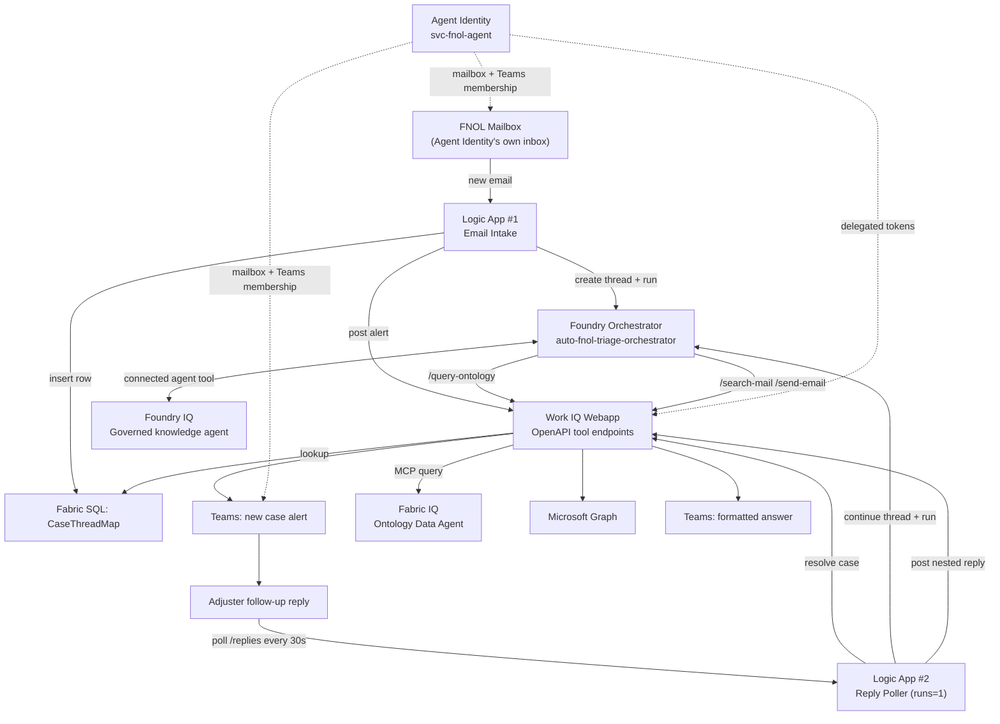

# Auto FNOL Triage — Foundry-Native, Logic Apps Accelerator

Azure-native accelerator for triaging First Notice of Loss (FNOL) emails with **Azure AI Foundry Agent Service**, **Azure Logic Apps**, **Microsoft Fabric**, and **Microsoft Graph**.

It demonstrates how to combine three "IQ" building blocks behind one orchestrator:

1. **Architecture** — how the Foundry orchestrator composes Fabric IQ, Foundry IQ, and Work IQ into one triage workflow. See [`docs/design-options.md`](docs/design-options.md).
2. **Concurrency & context isolation** — how concurrent cases stay isolated in Teams and Foundry so follow-up replies never cross-wire. See [`docs/teams-concurrency-design.md`](docs/teams-concurrency-design.md).

## Architecture diagram



Full diagram with legend and step-by-step flow: [`docs/architecture-diagram.md`](docs/architecture-diagram.md).
For a simpler, one-glance view of the same flow, see [`docs/workflow-diagram.md`](docs/workflow-diagram.md).

## Architecture at a glance

| Component | Role |
|---|---|
| **Orchestrator agent** | Azure AI Foundry Agent Service agent (`auto-fnol-triage-orchestrator`) that owns triage instructions, routing logic, and tool selection. |
| **Fabric IQ** | Fabric ontology data agent for structured entities such as Policy, Claim, Policyholder, Vehicle, Adjuster, FraudSignal, and SubrogationFlag. Exposed to the orchestrator through the Work IQ webapp's `/query-ontology` facade. |
| **Foundry IQ** | Existing governed knowledge agent for policy wording, FNOL rules, SIU guidance, regulatory knowledge, and subrogation methodology. Wired as a connected-agent tool inside the same Foundry project. |
| **Work IQ** | Deployed Flask webapp in [`triggers/webapp/`](triggers/webapp/) exposing OpenAPI-callable tools for SharePoint/OneDrive document search, Outlook mail search, ontology proxying, Teams posting, and escalation email sending. |
| **Agent Identity** | Dedicated Entra ID user (`svc-fnol-agent`) with its own mailbox, Teams membership, and delegated token cache. This is the default auth model (`AUTH_MODE=agent_identity`) for Fabric IQ queries, Teams posting, Work IQ mail access, and escalation emails. |
| **Email intake trigger** | Logic App [`triggers/logicapp/workflow.json`](triggers/logicapp/workflow.json) monitors the FNOL mailbox, creates a Foundry thread/run, posts the initial alert to Teams, and persists the case/thread mapping. |
| **Teams reply poller** | Logic App [`triggers/logicapp/workflow-teams-reply-poller.json`](triggers/logicapp/workflow-teams-reply-poller.json) polls each case thread's replies, continues the same Foundry thread, and posts nested follow-up answers back into the same Teams thread. |
| **Case/Teams correlation store** | Fabric SQL Database table `CaseThreadMap` mapping `CaseId -> TeamId, ChannelId, RootMessageId, FoundryThreadId, LastProcessedReplyId` so every case stays isolated end to end. |

## Capabilities

- Intake FNOL emails and generate a fast initial triage analysis with urgency, narrative summary, and next steps.
- Detect SIU fraud red flags from both the intake narrative and follow-up grounded lookups.
- Assess subrogation candidacy from case facts and follow-up investigation.
- Support Teams-based follow-up conversations for coverage, vehicle, policyholder, claim, CAT bulletin, and routing questions.
- Query Fabric IQ across multiple related entity types when a follow-up asks for more than one record category.
- Send escalation emails on request (for example to SIU or adjuster teams) via Microsoft Graph **only when explicitly asked**, never by guessing recipients.

## Quick start / deployment

Run from repo root:

```powershell
.\deploy_solution.ps1
```

Use [`.env.example`](.env.example) as the source of truth for required and optional configuration.

High-level deployment flow in `deploy_solution.ps1`:

0. **Prerequisites** — verify Azure CLI, Python, and local `.env` setup.
1. **Create Agent Identity user** — create the dedicated Entra user and pause for license/team/workspace/Foundry access setup.
2. **Register Agent Identity public-client app** — create the delegated-auth app registration and grant Graph/Fabric/SQL delegated scopes.
3. **Bootstrap MSAL token cache** — run the one-time Graph + Fabric + SQL device-code bootstrap for the Agent Identity.
4. **Create CaseThreadMap table** — provision the Fabric SQL table and index used for case/thread correlation.
5. **Deploy Work IQ webapp** — deploy the Flask app and push app settings, including the chunked token-cache seed.
6. **Create Foundry connection** — create the Foundry Custom Keys connection that injects the Work IQ API key.
7. **Create orchestrator agent** — provision the Foundry orchestrator and record its new `agent_id`.
8. **Deploy Logic Apps** — generate parameters/connections and deploy both the email-intake and Teams-reply-poller workflows.
9. **Grant Logic App roles** — grant both Logic Apps' managed identities the RBAC/app permissions they need for Foundry and Graph operations.

## Request / response flow

1. New FNOL email lands in the Agent Identity mailbox.
2. Email-intake Logic App creates a new Foundry thread, posts the email as the first message, and runs the orchestrator.
3. The orchestrator returns an **initial-analysis-only** response for first-pass intake (no tool calls on that first message).
4. Work IQ posts the result as a **new top-level Teams message** and persists `CaseThreadMap`.
5. The reply-poller Logic App enumerates open cases, polls each root message's `/replies`, and filters out already-processed or self-authored agent replies.
6. A human follow-up is appended to the **same Foundry thread**, so the agent answers with full case context.
7. Work IQ posts the answer as a **nested Teams reply** under the original case thread.

## Repo layout

```text
foundry/
  create_orchestrator_agent.py      # Creates/recreates the Foundry orchestrator agent and wires its tools/instructions.
  create_workiq_connection.py       # Creates the Foundry Custom Keys connection for the Work IQ webapp API key.
  deploy_diagnostic_notebook.py     # Publishes the Fabric SP-auth diagnostic notebook into a Fabric workspace.
  fabric_ontology_openapi.json      # OpenAPI contract for the orchestrator's Fabric IQ ontology tool facade.
  fabric_sp_auth_diagnostic_notebook.ipynb # Notebook for diagnosing Fabric service-principal auth behavior.
  mcp_sample_sp_auth.ipynb          # Sample notebook for calling Fabric MCP endpoints with service-principal auth.
  mcp_sample_user_auth.ipynb        # Sample notebook for calling Fabric MCP endpoints with delegated user auth.
  orchestrator_agent_id.txt         # Last-created orchestrator agent id, consumed by deployment scripts.
  run_agent_thread.py               # Helper to create/continue Foundry threads and poll runs.
  tools_fabric_iq.py                # Python facade that proxies ontology questions to the Fabric MCP data agent.
  tools_workiq_graph.py             # Legacy/local Work IQ Graph helper module under `foundry/`.
  workiq_graph_openapi.json         # OpenAPI contract for Work IQ search/mail/send-email tool endpoints.

shared/
  agent_identity_auth.py            # Shared delegated-auth helper for the Agent Identity, including chunked cache reassembly.
  bootstrap_agent_identity_tokens.py # One-time bootstrap for Graph + Fabric + SQL tokens into one MSAL cache.
  case_thread_store_schema.sql      # Fabric SQL schema for the CaseThreadMap correlation table and index.
  create_case_thread_map.py         # Creates/updates the CaseThreadMap table in Fabric SQL.
  post_to_teams.py                  # Shared Teams posting + case-thread persistence helpers used outside the webapp.

triggers/logicapp/
  connections.json                  # Generated local Logic App connection bindings.
  connections.json.template         # Template for Logic App connection bindings.
  deploy_logic_apps.py              # Generates parameters/connections and deploys both Logic Apps via ARM REST.
  parameters.json                   # Generated local Logic App parameter values.
  parameters.json.template          # Template for Logic App parameters.
  workflow-teams-reply-poller.json  # Sequential reply-poller Logic App for Teams follow-up handling.
  workflow.json                     # Email-intake Logic App for new FNOL mailbox messages.

triggers/webapp/
  .secrets/agent_identity_token_cache.bin # Local token-cache seed used for webapp packaging/tests (not for source control).
  agent_identity_auth.py            # Webapp copy of Agent Identity auth helper; must be kept manually in sync with `shared/`.
  app.py                            # Flask app exposing Work IQ, Teams, and case-thread REST endpoints.
  deploy_webapp.py                  # Deploys the Flask webapp to Azure App Service and pushes app settings.
  post_to_teams.py                  # Webapp Teams helper that renders markdown to Teams-friendly HTML with urgency color/spacing fixes.
  requirements.txt                  # Python dependencies for the Flask webapp.
  tools_fabric_iq.py                # Flask-side ontology proxy used by `/query-ontology`.
  tools_workiq_graph.py             # Flask-side Graph implementations for `/search-documents`, `/search-mail`, and `/send-email`.

triggers/azure-function/
  EmailTriggerFunction/__init__.py               # Skeleton Function alternative for Graph-mail webhook intake.
  EmailTriggerFunction/function.json             # Function binding for the email webhook trigger.
  WorkIQFunction/SearchDocuments/__init__.py     # Function endpoint wrapping document search.
  WorkIQFunction/SearchDocuments/function.json   # Function binding for the document-search endpoint.
  WorkIQFunction/SearchMail/__init__.py          # Function endpoint wrapping mail search.
  WorkIQFunction/SearchMail/function.json        # Function binding for the mail-search endpoint.
  host.json                                      # Azure Functions host configuration.
  requirements.txt                               # Python dependencies for the Function-based alternative.
  tools_workiq_graph.py                          # Function-side Work IQ Graph helper implementation.
```

## Work IQ webapp endpoints

`triggers/webapp/app.py` currently exposes 12 routes:

- `POST /search-documents`
- `POST /search-mail`
- `POST /send-email`
- `POST /query-ontology`
- `GET /healthz`
- `POST /post-new-case-alert`
- `POST /post-case-reply`
- `POST /resolve-case-reply`
- `POST /insert-case-thread-map`
- `POST /list-open-cases`
- `POST /list-case-replies`
- `POST /mark-reply-processed`

## Agent Identity pattern

The reference implementation now assumes **delegated auth via a dedicated Agent Identity** rather than a service-principal-only design.

| Aspect | Current pattern |
|---|---|
| Identity | Dedicated Entra ID user such as `svc-fnol-agent` |
| Why it exists | Fabric ontology queries and Teams channel posting require delegated user context; the same identity also owns mailbox search and escalation email send. |
| Mailbox | The FNOL intake mailbox is the Agent Identity's own mailbox. |
| Teams | The Agent Identity is a real member of the target team/channel and posts as itself. |
| Token bootstrap | Use `shared/bootstrap_agent_identity_tokens.py` to acquire Graph, Fabric, and Azure SQL scopes into one MSAL cache. |
| Webapp deployment | `deploy_webapp.py` base64-encodes the token cache, chunks it across app settings, and `agent_identity_auth.py` reassembles it at runtime. |
| Default mode | `AUTH_MODE=agent_identity` |

## Known operational gotchas

- Use the **Foundry User** RBAC role for Logic App managed identities calling Foundry thread/message/run APIs; legacy **Cognitive Services User** alone is not sufficient for the current Foundry data plane.
- There are **two copies** of `agent_identity_auth.py` (`shared/` and `triggers/webapp/`); keep them manually in sync.
- Use `shared/bootstrap_agent_identity_tokens.py` for the full Graph + Fabric + SQL bootstrap. The `shared/agent_identity_auth.py --bootstrap` path is legacy and incomplete.
- Keep `triggers/logicapp/workflow-teams-reply-poller.json` trigger concurrency at `runtimeConfiguration.concurrency.runs = 1` to avoid overlapping poll cycles racing on the same Foundry thread.
- Recreating the orchestrator with `foundry/create_orchestrator_agent.py` generates a **new agent id**; always redeploy **both** Logic Apps afterward so the updated id is propagated.

## Relationship to the underlying IQ components

- **Fabric IQ**: this accelerator consumes the existing `AutoFNOL_Ontology` Fabric data agent via its endpoint; no ontology remodel is required.
- **Foundry IQ**: this accelerator consumes the existing governed knowledge agent as a connected tool in the same Foundry project; no changes to the knowledge agent or index are required.
- **Work IQ**: this accelerator implements equivalent operational retrieval directly against Microsoft Graph (document search, mailbox search, and email send) behind a small webapp, so no separate low-code connector is required.
