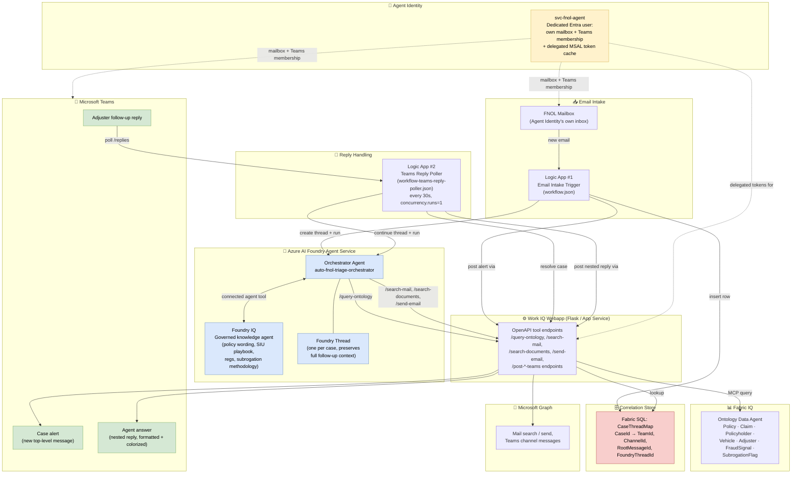

# Architecture Diagram

This diagram reflects the current Foundry-native, Logic Apps implementation in this repo
(as opposed to the Copilot Studio / Power Automate variant in the companion
[`Ins_FNOL_MicrosoftIQ_accelerator`](https://github.com/sagarbathe/Ins_FNOL_MicrosoftIQ_accelerator) repo).

## Flow summary

1. A new FNOL email lands in the Agent Identity's own mailbox.
2. **Logic App #1** creates a Foundry thread, runs the orchestrator for an initial-analysis-only pass, posts the result as a new Teams message via the Work IQ webapp, and records the case in `CaseThreadMap`.
3. An adjuster replies in the Teams thread.
4. **Logic App #2** (30-second, single-concurrency poll) detects the reply, resolves it to a case via the webapp, appends it to the **same Foundry thread**, and re-runs the orchestrator with full case context.
5. The orchestrator calls **Fabric IQ** (structured entity lookups), **Foundry IQ** (governed knowledge, as a connected agent tool), and/or Microsoft Graph (mail search/send) through the Work IQ webapp's OpenAPI tools — all authenticated as the **Agent Identity**, never on-behalf-of the human user.
6. The answer is posted back as a **nested Teams reply**, formatted with block-level spacing and urgency-color highlighting for readability.
