# Detailed Call Sequence

This document complements [`architecture-diagram.md`](architecture-diagram.md) (component-level
flowchart) with the exact, ordered, action-by-action call sequence for both Logic Apps, as deployed
today. Action names match the live workflow definitions
(`la-fnol-email-intake`, `la-fnol-teams-reply-poller`) 1:1, so this can be used directly against Logic
Apps run history when troubleshooting.

## 1. New email intake (`la-fnol-email-intake`)

```mermaid
sequenceDiagram
    autonumber
    participant MB as FNOL Mailbox<br/>(svc-fnol-agent)
    participant LA1 as Logic App #1<br/>email-intake
    participant FOUNDRY as Foundry Agent Service<br/>(Orchestrator + tools)
    participant IQ as Foundry IQ<br/>(connected agent tool)
    participant WIQ as Work IQ Webapp<br/>(app-autofnol-workiq)
    participant GRAPH as Microsoft Graph
    participant SQL as Fabric SQL<br/>CaseThreadMap
    participant TEAMS as Teams Channel

    MB->>LA1: Office 365 trigger: "When a new email arrives"<br/>(polls every 1 min)
    LA1->>LA1: Compute_stable_case_id (Compose)<br/>hash of Internet-Message-Id
    LA1->>FOUNDRY: Create_Foundry_thread (HTTP POST /threads)
    FOUNDRY-->>LA1: thread_id
    LA1->>LA1: Parse_thread_id (ParseJson)
    LA1->>FOUNDRY: Post_email_as_message<br/>(HTTP POST /threads/{id}/messages, role=user,<br/>content = raw email subject/body)
    LA1->>FOUNDRY: Start_run (HTTP POST /threads/{id}/runs,<br/>assistant_id = orchestrator agent)
    FOUNDRY-->>LA1: run_id
    LA1->>LA1: Parse_run (ParseJson)

    rect rgb(245,245,245)
    Note over FOUNDRY: NEW EMAIL INTAKE instruction path:<br/>tools-free initial pass - no Fabric IQ / Foundry IQ /<br/>Work IQ calls on this first message
    FOUNDRY->>FOUNDRY: Reason over email text only<br/>(severity / SIU red-flag / subrogation screen<br/>from narrative, per system instructions)
    end

    loop Until_run_completes (poll every 2s)
        LA1->>LA1: Delay_2s (Wait)
        LA1->>FOUNDRY: Get_run_status (HTTP GET /threads/{id}/runs/{run_id})
        FOUNDRY-->>LA1: status
    end
    LA1->>LA1: Validate_run_completed (ParseJson)<br/>content must be a QUOTED JSON string, e.g. concat('"',status,'"')

    alt run failed / timed out
        LA1->>MB: Send_failure_email_run_not_completed
        LA1->>LA1: Terminate_run_not_completed
    else run completed
        LA1->>FOUNDRY: Get_latest_message (HTTP GET /threads/{id}/messages)
        FOUNDRY-->>LA1: assistant's triage analysis text
        LA1->>WIQ: Post_new_case_alert_to_Teams<br/>(HTTP POST /post-teams-message)
        WIQ->>GRAPH: POST /teams/{team}/channels/{channel}/messages<br/>(Agent Identity delegated token)
        GRAPH-->>TEAMS: New top-level case-alert message
        WIQ-->>LA1: rootMessageId
        LA1->>WIQ: Persist_CaseThreadMap_row (HTTP POST)
        WIQ->>SQL: INSERT CaseId, FoundryThreadId, TeamId,<br/>ChannelId, RootMessageId, last_processed_reply_id=NULL
    end

    Note over LA1: Catch_and_notify_failure scope wraps the whole<br/>Try_process_case scope: any unhandled Failed/TimedOut<br/>sends an internal "[Auto FNOL Triage] Case processing<br/>FAILED" email to the mailbox and terminates - this is<br/>diagnostic noise, not a case, and search_mail's<br/>relevance ranking can surface it ahead of real content<br/>(see Known Issues below).
```



## 2. Adjuster reply handling (`la-fnol-teams-reply-poller`, every 30s, `concurrency.runs=1`)

```mermaid
sequenceDiagram
    autonumber
    participant TIMER as Recurrence Trigger<br/>(every 30s)
    participant LA2 as Logic App #2<br/>reply-poller
    participant WIQ as Work IQ Webapp
    participant SQL as Fabric SQL<br/>CaseThreadMap
    participant GRAPH as Microsoft Graph
    participant TEAMS as Teams Channel
    participant FOUNDRY as Foundry Agent Service<br/>(Orchestrator + tools)
    participant FABIQ as Fabric IQ<br/>(via Work IQ /query-ontology)
    participant FIQ as Foundry IQ<br/>(connected agent tool)

    TIMER->>LA2: fire
    LA2->>WIQ: List_open_cases (HTTP GET)
    WIQ->>SQL: SELECT * FROM CaseThreadMap WHERE status='open'
    SQL-->>LA2: list of open cases

    loop For_each_open_case
        LA2->>WIQ: List_case_replies (HTTP GET, by RootMessageId)
        WIQ->>GRAPH: GET channel message replies
        GRAPH-->>LA2: reply list (id, from.user.id, body, createdDateTime)
        LA2->>LA2: Filter_to_new_human_replies (Query)<br/>WHERE from.user.id != agentIdentityUserId<br/>AND id > last_processed_reply_id

        loop For_each_new_reply
            LA2->>FOUNDRY: Post_reply_to_Foundry_thread<br/>(HTTP POST /threads/{FoundryThreadId}/messages,<br/>role=user, content=reply text)
            LA2->>FOUNDRY: Start_followup_run (HTTP POST /threads/{id}/runs)
            FOUNDRY-->>LA2: followup_run_id
            LA2->>LA2: Parse_followup_run (ParseJson)

            rect rgb(245,245,245)
            Note over FOUNDRY: FOLLOW-UP QUESTION path: Fabric IQ / Foundry IQ /<br/>Work IQ tool calls ARE expected here
            alt structured record lookup (Policy/Claim/etc by ID)
                FOUNDRY->>WIQ: /query-ontology (OpenAPI tool call)
                WIQ->>FABIQ: MCP query (Agent Identity token)
                FABIQ-->>WIQ: record(s)
                WIQ-->>FOUNDRY: JSON result
            end
            alt general knowledge / SIU red flags / policy wording
                FOUNDRY->>FIQ: connected_agent tool call
                FIQ-->>FOUNDRY: governed answer + citations
            end
            alt SIU routing change / CAT bulletin lookup
                FOUNDRY->>WIQ: workiq_graph_search_searchMail /<br/>searchDocuments (OpenAPI tool call)
                WIQ->>GRAPH: GET /me/messages?$search=...<br/>(top floored to >=10, fetch_top=25,<br/>NOT combined with $filter - Graph 400s that combo)
                GRAPH-->>WIQ: matching messages (full body + bodyPreview)
                WIQ->>WIQ: client-side filter to last 90 days,<br/>trim to requested top
                WIQ-->>FOUNDRY: subject/from/receivedDateTime/<br/>bodyPreview/body(full text)/webLink
                Note over FOUNDRY: MUST read full `body` field completely;<br/>never invent/hallucinate an address not<br/>verbatim in that text
            end
            alt human explicitly asked to send an escalation email
                FOUNDRY->>WIQ: workiq_graph_search_sendEmail (OpenAPI tool call)
                WIQ->>GRAPH: POST /me/sendMail
            end
            end

            loop Until_followup_run_completes (poll every 2s)
                LA2->>LA2: Delay_2s (Wait)
                LA2->>FOUNDRY: Get_followup_run_status (HTTP GET)
                FOUNDRY-->>LA2: status
            end
            LA2->>LA2: Validate_followup_run_completed (ParseJson)<br/>same quoted-content rule as Validate_run_completed

            LA2->>FOUNDRY: Get_followup_latest_message<br/>(runs regardless of Validate's outcome -<br/>runAfter: Succeeded/Failed/Skipped/TimedOut)
            FOUNDRY-->>LA2: assistant's follow-up answer text
            LA2->>WIQ: Post_ack_reply_to_Teams (HTTP POST)
            WIQ->>GRAPH: POST nested reply under RootMessageId
            GRAPH-->>TEAMS: Nested reply (formatted answer)
            LA2->>WIQ: Mark_reply_processed (HTTP POST)
            WIQ->>SQL: UPDATE CaseThreadMap<br/>SET last_processed_reply_id = this reply's id
        end
    end
```

## Known issues this sequence has surfaced (fixed in this repo)

| # | Symptom | Root cause | Fix |
|---|---|---|---|
| 1 | Trigger never fires | Trigger's connection reference used key `office365-1`; `$connections` map only registered `office365` | Align the key, redeploy with full `{definition, parameters}` body |
| 2 | Trigger fires but no runs / wrong mailbox behavior | API connection's `displayName` said `svc-fnol-agent`, but `authenticatedUser.name` (the real identity) was a different user | Re-authorize the connection as the correct user; always check `authenticatedUser.name`, not `displayName` |
| 3 | `Validate_run_completed` / `Validate_followup_run_completed` fails with `InvalidJSON` | `ParseJson`'s `content` was the raw unquoted string `completed` - not valid JSON | Use `concat('"', status, '"')` so `content` is literally quoted JSON text (do **not** wrap with `json()`, which unwraps it right back) |
| 4 | `Post_ack_reply_to_Teams` / `Post_new_case_alert_to_Teams` return HTTP 500 "Silent token acquisition failed" | Work IQ webapp's MSAL delegated token cache for the Agent Identity expired | Re-run `bootstrap_agent_identity_tokens.py` (interactive device-code, 3 scopes) and redeploy the webapp with the refreshed cache |
| 5 | Reply posted in Teams is never picked up | Human tester replied while signed in **as the Agent Identity itself** (`svc-fnol-agent`); `Filter_to_new_human_replies` intentionally excludes `from.user.id == agentIdentityUserId` to avoid the bot replying to itself | Reply as a different, real human Teams account |
| 6 | SIU-routing-change email search returns "no relevant email found" even though one exists | `top` was LLM-chosen as `1`, and Graph's `$search` relevance ranking did not rank the real email first; also only `bodyPreview` (255 chars) was returned, so even when found, addresses/instructions past that point were invisible to the model | `search_mail` now floors `top` to 10, over-fetches (`fetch_top=25`) and filters to the last 90 days client-side (Graph's `/me/messages` rejects `$search` + `$filter` together - HTTP 400); results now include the **full** plain-text `body`, and the agent's instructions require reading it completely |
| 7 | Escalation email sent to a plausible-looking but nonexistent/wrong address | Orchestrator agent inferred/invented a recipient instead of quoting one verbatim from tool output | Instructions now require the recipient to come verbatim from the human's message or the full `body` of a Work IQ mail-search hit, or else stop and ask - never guess |
| 8 | Foundry "Publish to Teams" bot in Teams can't call Fabric IQ / Foundry IQ / Work IQ | That feature is a **separate, unsupported path**: it auto-creates its own Entra "AgentIdentity" service principal (zero RBAC by default) and Azure Bot Service resource, entirely outside this repo's Logic-App-based Teams integration | Do not use Foundry's native Publish-to-Teams for this accelerator; keep the two-Logic-App email/Teams design (`la-fnol-email-intake` + `la-fnol-teams-reply-poller`) as the only Teams surface |
| 9 | Compound follow-up questions (e.g. "what's the fraud policy, and does this policyholder have fraud history?") only got answered for one part | Orchestrator instructions had routing rules per question *type*, but no general rule to detect and decompose a single message containing **multiple** sub-questions | `ORCHESTRATOR_INSTRUCTIONS` in `foundry/create_orchestrator_agent.py` now has a "COMPOUND / MULTI-PART QUESTIONS" section requiring the agent to split multi-part questions, route/call a tool for every sub-question (not just the first), and synthesize one consolidated, per-part-grounded reply. Push changes live with `python foundry/update_orchestrator_agent.py` (keeps the same `agent_id`). |
| 10 | Foundry portal's **Traces** tab shows older conversations but never today's Teams/email-originated runs, even with Application Insights connected | Empirically, the Traces tab only captures conversations started in the Foundry portal's own Playground/test chat - runs created via the raw Threads/Runs REST API (which is what both Logic Apps use) are never traced, regardless of App Insights health | Use `python foundry/inspect_run_trace.py [thread_id [run_id]]` instead - it reads the same Threads/Runs/RunSteps data directly from the Agent Service API, which always persists full tool-call detail regardless of what the Traces UI shows |
| 11 | `/query-ontology` fails for **every** question with `{"error":"unhandled errors in a TaskGroup (1 sub-exception)"}` | The underlying Fabric capacity backing the Fabric IQ data agent was **Paused** (e.g. auto-pause after inactivity); the MCP server's `CapacityNotActive` error response made the `mcp` package's `streamablehttp_client` surface a generic `anyio.TaskGroup` exception instead of the real Fabric error, and `triggers/webapp/app.py`'s routes return only `str(e)` with no server-side traceback logging | Check the Fabric capacity state (`az resource show --ids <capacity resource id> --query properties.state`) and resume it if `Paused` (`az rest --method post --url "https://management.azure.com<capacity resource id>/resume?api-version=2023-11-01"`); consider disabling auto-pause on capacities backing production Fabric IQ data agents |
